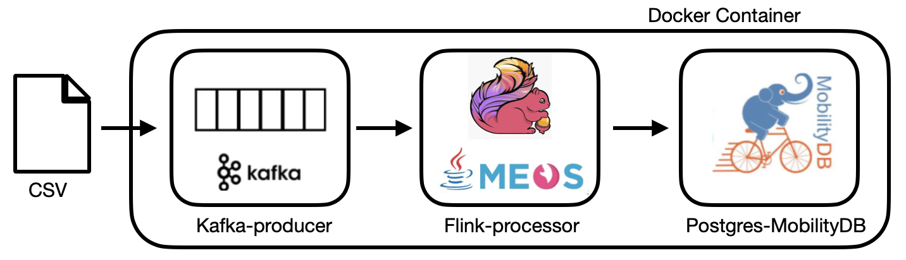
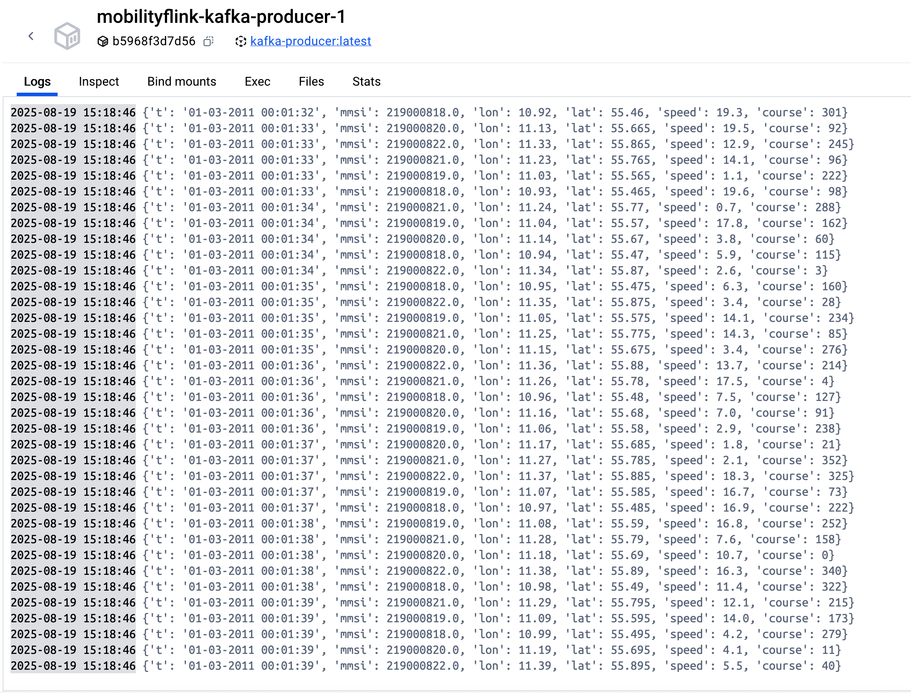
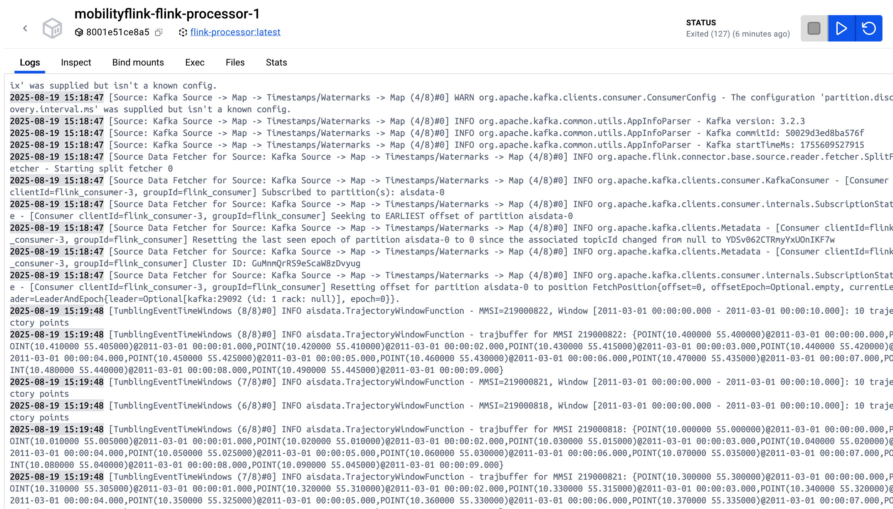

MobilityFlink
===============
An open-source geospatial trajectory data streaming platform based on [Flink](https://flink.apache.org/).

MobilityFlink explores the advantages of [MobilityDB](https://github.com/MobilityDB/MobilityDB) datatypes and functions in the Flink environment, using the [JMEOS](https://github.com/MobilityDB/JMEOS) library as middleware.

The MobilityDB project is developed by the Computer & Decision Engineering Department of the [Université libre de Bruxelles](https://www.ulb.be/) (ULB) under the direction of [Prof. Esteban Zimányi](http://cs.ulb.ac.be/members/esteban/). ULB is an OGC Associate Member and member of the OGC Moving Feature Standard Working Group ([MF-SWG](https://www.ogc.org/projects/groups/movfeatswg)).

More information about MobilityDB, including publications, presentations, etc., can be found in the MobilityDB [website](https://mobilitydb.com).

# Building Real-Time Data Streaming using Kafka, Apache Flink, and Postgres

## Vessel Count by Area and Time Period
This query is a spatiotemporal aggregation. We count the number of distinct vessels in a specified geographic area and period. We use spatial filtering with bounding boxes and temporal filtering.

## Structure and data pipeline
The pipeline consists of three docker images (Kafka, Flink, and MobilityDB) built into a docker container and connected internally by a network bridge.

Data is generated by reading a CSV file into Kafka (Kafka producer) by the python-producer.py. To change the data file, you can modify the CSV in python-producer.py.

Flink consumes directly into the Kafka topic. It then proceeds to deserialize the message into a data structure. In addition, we set a watermark strategy, that is, assigning event timestamps, handling out-of-order data and defining how late a record can be. Also, we define how long a data source can be idle (not receiving any data) before its resources are released. For counting ships, we use an aggregation function. This aggregation function works inside the window; in this case, we have a sliding window of 10 seconds. The count is done by checking (CountAggregator()) if the point intersects with the spatial bounding box. 

In addition, there is a timer to wait for Kafka to produce some tuples before starting Flink (wait-for-it.sh).  

## Prerequisites
Docker
Maven 3.9.6
Java 21
JMEOS (JMEOS jar file is already include in flink-processor/jar. To install a new version of JMEOS, go to https://github.com/MobilityDB/JMEOS/tree/main/jar and download the JAR file.)

## To compile and run
We should create a docker image for Kafka, Flink, and MobilityDB. To do this, we go to each directory and create each image. Finally, we go to the main directory and compose the docker container.

cd postgres  
docker build -t postgres .  
cd ..  
cd kafka-producer  
docker build -t kafka-producer .  
cd ..  
cd flink-processor  
mvn clean package   
docker build -t flink-processor .  
cd ..  
docker-compose up -d  

## Results 

Kafka producer

Flink Processor

